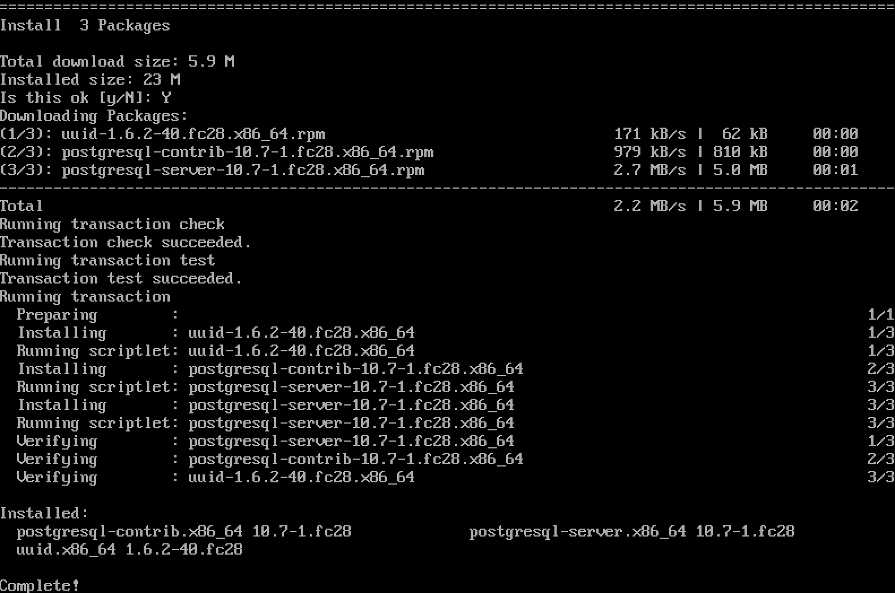
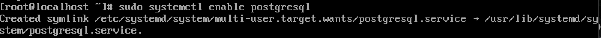
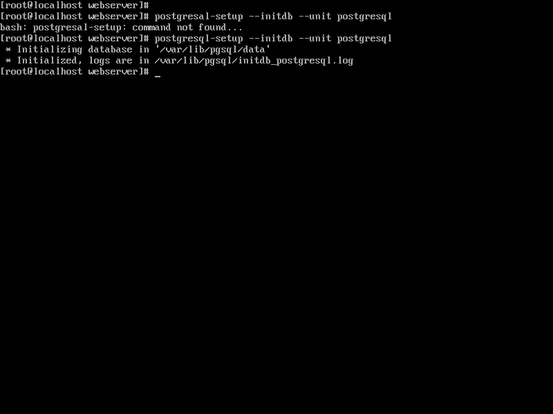
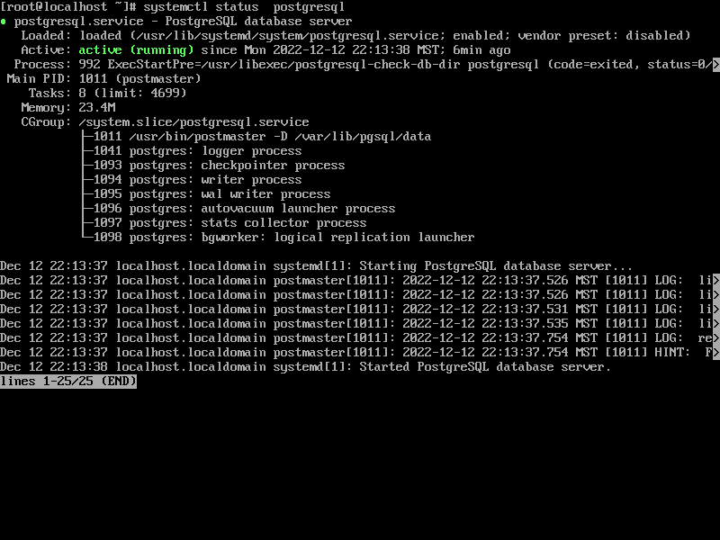
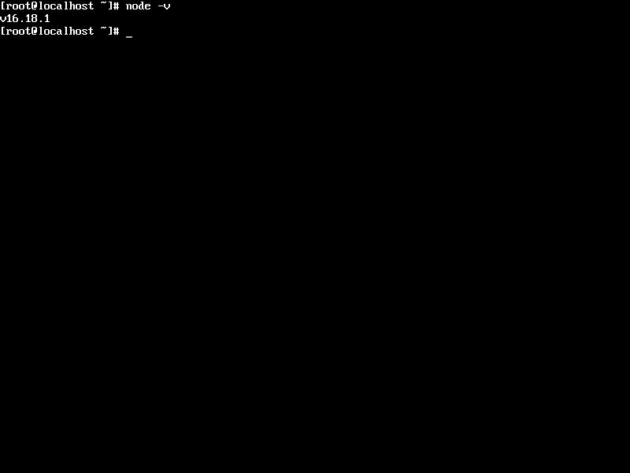
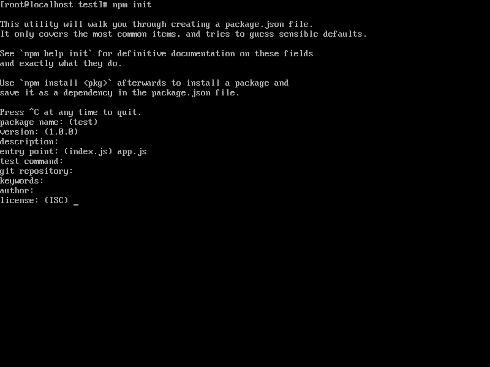
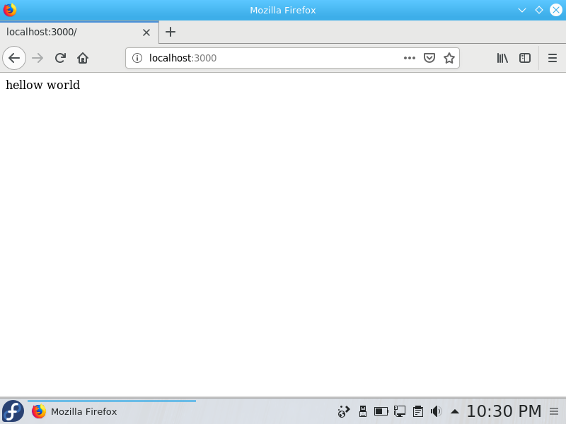
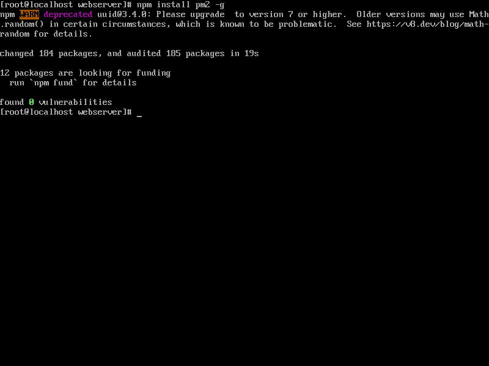
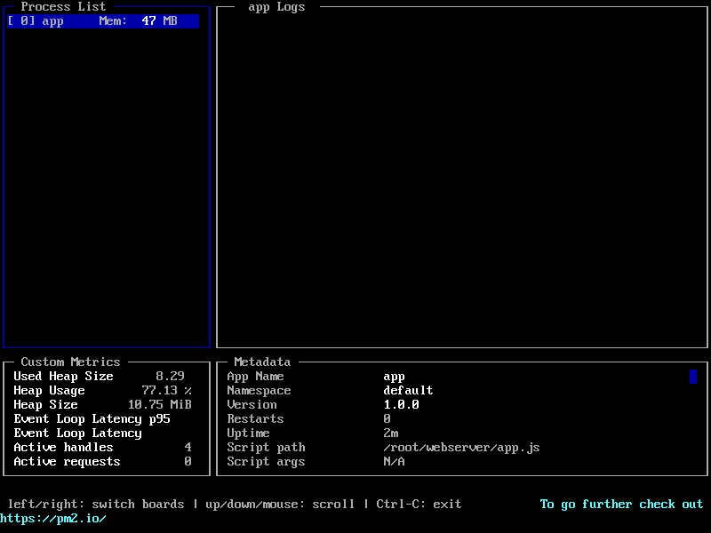

# PERN

This tutorial will help you to install a Web Server on your fedora distribution. For this tutorial we will be using Fedora 28 as the Linux distribution. We will install a PERN stack which stands for PostgreSQL, Express, Reach, and Node.js.

# PERN Installation

## PostgreSQL

PostgreSQL is the database used in a PERN stack. PostgreSQL is available to install through dnf, the packaged manager for Fedora:

Open the terminal and run the following commands: 
```
sudo dnf install postgresql-server postgresql-contrib
```
The image bellow shows the expected output from the command above.



Now you have PostgreSQL installed in your Linux machine, but is not running yet. PostgreSQL comes disable by default so you need to enable so it can starts to run.

Open the terminal and run the following command to enable your PostgreSQL. This command also allows it to be started on boot of the OS
```
sudo systemctl enable postgresql
```



The last step is populate the database with a few initial data. You can do this running the following command:
```
sudo postgresql-setup --initdb --unit postgresql
```



Now you have the first step of your PERN done. If you want to make sure that installation process of the PostgreSQL was done correctly you can run the following command:
```
systemctl status postgresql
```

The output should look something like this:




## Node.js Installation

Node.js can also been installed through the package manager dnf. In some versions of fedora when installed through dnf Node.js is coming with an outdated version that won't work, so the best way is going through a public repository in GitHub.

Open your terminal and run the following commands:
```
wget -qO- https://raw.githubusercontent.com/nvm-sh/nvm/v0.39.2/install.sh | bash

source $HOME/.bashrc

nvm install lts/gallium

nvm alias default lts/gallium

nvm use default
```

To make sure that Node.js was installed correctly you can run the following command:
```
node -v
```

The output will show you the Node version installed and should look something like this:



## Express

Now we get to the point to install Express which will be our Web Server. You need to have Node.js before installing Express.

First things to do is creating a directory to host the server and then navigating to the directory. Run the following commands:
```
mkdir myapp
cd myapp
```

Inside the directory previously created you can run the following command:
```
npm init
```

In this process it will prompt you for several things which for now you can just hit enter and go with the default values for with _ONE_ _EXCEPTION_. When prompted for "entry point" enter the value of *app.js*.

It should look like:

```
entry point: app.js
```

This should be your output after the previous commands:



After that you can install express with the command:
```
npm install express
```

Now you have Express installed in your Fedora, but we still need a few steps to set it up.

Inside your *myapp* directory create a file using vi and give it the name of _app.js_. We are using this name for this tutorial, but it can be any other name that you want to. For this tutorial we will use _app.js_.

After opened vi or any other text editor that you want to and type the following:

```
const express = require('express')
const app = express()
const port = 3000

app.get('/', (req, res) => {
  res.send('Hello World!')
})

app.listen(port, () => {
  console.log(`Example app listening on port ${port}`)
})
```

Save the file and quit.

Run the app using the following command:

```
node app.js
```

The cursor on the terminal will start to blink which means that the app is running.

Now open the browser inside your fedora and load _http://localhost:3000/_. It needs to be inside your fedora because the server is running locally.



## Setting up PERN in boot 

To make our Seb Server able to start at boot every time you start your fedora we will user pm2. Pm2 is a daemon process manager that helps you keep your applications up.

First thing we need to do is to install pm2. We can do that through npm.

In terminal run the following code:

```
npm install pm2 -g
```



To start your Web Server with pm2 you run the following code:

```
pm2 start app.js
```

You can use the _pm2_ _list_ command to check the app that are being managed by pm2.

Now app.js is being managed by pm2, but it will stop as soon as you restart your fedora. To prevent that you can run the following command that will create a startup script to your app.

```
pm2 startup
```

Note: Some version of fedora will have trouble with pm2 because of SELinux. SELinux will block the script created by pm2 and won't let the app run alone at boot time. If you run to this issue you can follow the instruction on this website to change SELinux permissions: 
https://docs.fedoraproject.org/en-US/quick-docs/changing-selinux-states-and-modes/#selinux-changing-to-permissive-mode

## Monitoring

Pm2 also comes with a tools to monitoring your applications directly from your terminal.

In your terminal enter the following command

```
pm2 monit
```

The picture bellow is an example of monitoring the application that we just did in the tutorial



## Example

Bellow is an example of PERN running.


